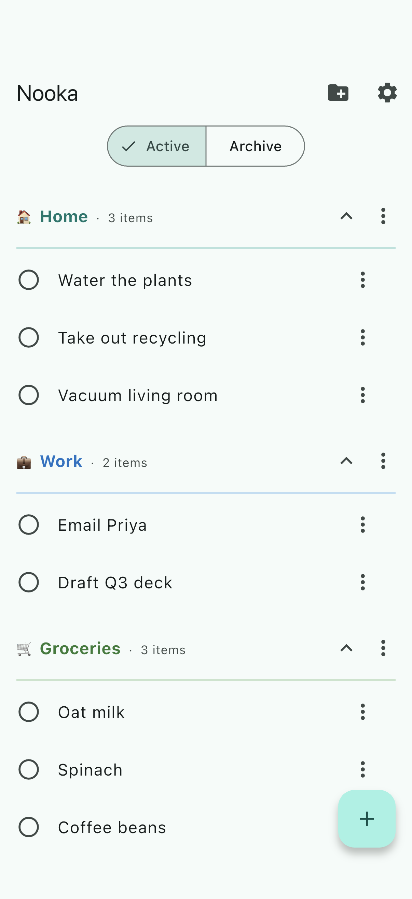
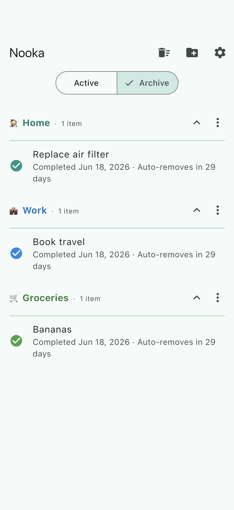
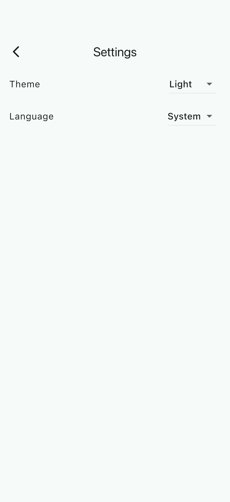
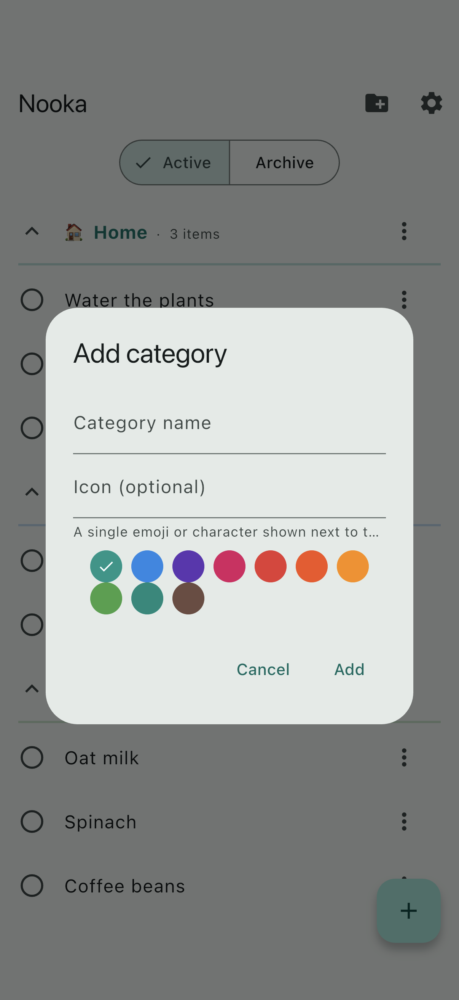
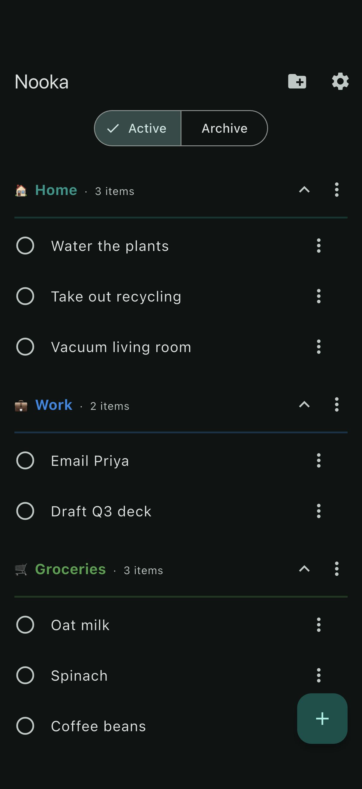
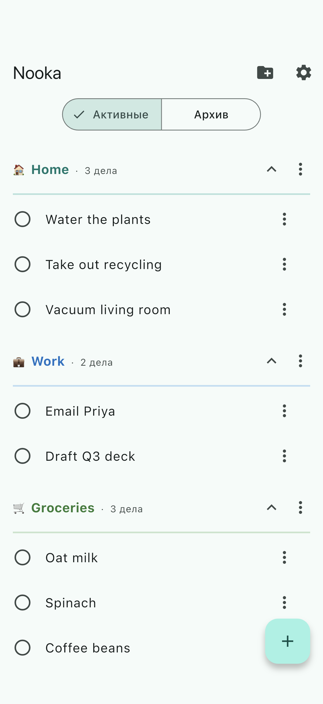

# nooka

A **local-first to-do list. Your data, on your device.**

[](https://github.com/quotidianlabs/nooka/releases/latest)
[](https://github.com/quotidianlabs/nooka/actions/workflows/ci.yml)
[](https://github.com/quotidianlabs/nooka/actions/workflows/ci.yml)
[](LICENSE)


nooka is a small, fast to-do list built around two ideas: **you own your data**
(everything lives in an on-device SQLite database — no account, no backend) and
**finishing a task gets it out of your way** (completing an item archives it,
and archived items auto-delete 30 days later). iOS + Android, English and
Russian.

| Home | Archive | Settings |
|---|---|---|
|  |  |  |

| New category | Dark theme | Home (Русский) |
|---|---|---|
|  |  |  |

## Features

- 🗂️ Colored categories holding to-do items, each with a single-emoji icon
- ✅ Complete an item to archive it; archived items show a 30-day auto-delete countdown
- ↩️ Restore an archived item to active, or clear the whole archive at once
- ↕️ Drag-to-reorder categories and items
- 💬 Undo toast on every complete and restore
- 🎨 Material 3 with light & dark themes (follows the device, or pick one)
- 🌍 English + Russian, following the device locale with an in-app override
- 📱 iOS and Android from one Flutter codebase

## Architecture

Layered MVVM with Riverpod: **UI** (views + per-feature view models) →
**domain** (pure functions + models) → **data** (a `TodoRepository` over a
Drift SQLite database, plus preferences). Generated code is committed.

The design and implementation history for every change lives in
[`planning/`](planning/) — see, e.g., the
[to-do list foundation](planning/changes/archive/2026-06-17.01-todo-list/design.md)
and the
[planning-convention adoption](planning/changes/archive/2026-06-18.01-adopt-planning-convention/design.md).
The living capability docs are in [`architecture/`](architecture/README.md).

## Getting started

Requires [Flutter 3.44.2](https://flutter.dev). Then:

```bash
flutter pub get
flutter run
```

Generated `*.g.dart` (Drift, Riverpod, l10n) is committed, so a normal run
needs no code generation. After changing `@riverpod`/Drift code, regenerate
with `dart run build_runner build --delete-conflicting-outputs`.

## Development

This repo uses [`just`](https://github.com/casey/just):

```bash
just lint    # dart format + flutter analyze
just test    # flutter test (35 unit/widget tests)
```

The README screenshots are generated deterministically — see
[`docs/screenshots.md`](docs/screenshots.md) to regenerate them.

## License

[MIT](LICENSE) © 2026 quotidianlabs
